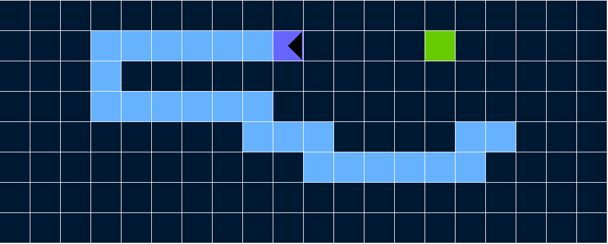
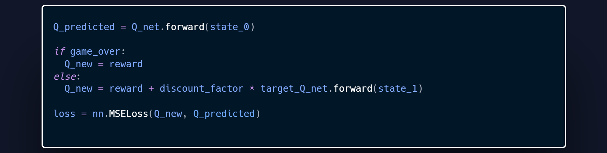
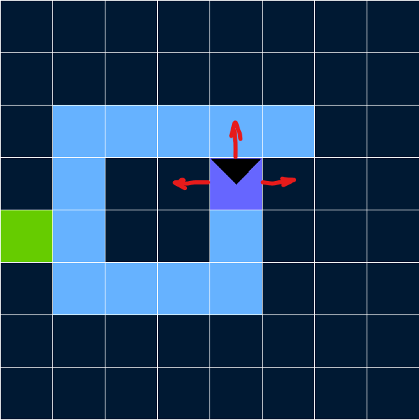
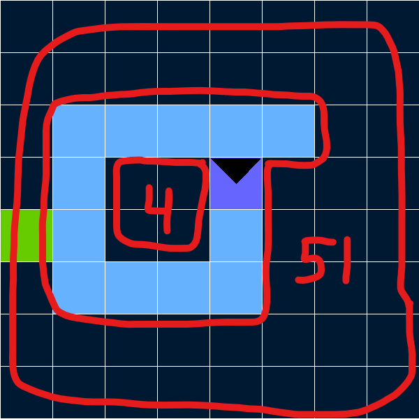
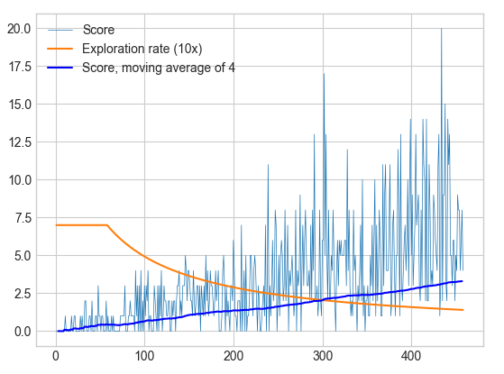


<![endif]-->

# Snake Game AI

Classic snake game implementation with pygame and an environment for teaching the agent to play the game using deep Q learning. This pet project was motivated by the will to make something cool by myself using knowledge acquired in computer vision and AI classes :)

## Game environment implementation

The snake game on its own is implemented in **game_class.py** and **snake.py** files.

The **pygame** library was used for the UI of the game. Game screen supports light⬜ and dark🟦 mode and has adjustable parameters, such as size of the screen and game field size (width in squares).

>The game can be tested in game_class.py main function, when the user controls the snake with W, A, D buttons.

## Deep Q learning

- **The idea** of deep Q learning is a modification of naive Q-table reinforcement learning algorithm where the Q-table is replaced with a neural network. Instead of a *Q(s, a):q* function, neural net is an approximation of a Q(s) function that outputs pairs *(action, quality)*. The net is updated using the classic Bellman equation.

- **The implementation** consists of an agent class, neural net model, custom loss function class and a queue to store the training data (transitions *(s_0, a, r, s_1)*). The agent contains a bunch of different parameters and methods, that were used to experiment with learning.

Neural **Qnet** on itself is a small linear 11x256x3 net, implemented with usage of pytorch. Is updated using the **loss_function.py** which can be described as following:

## Results

I was able to teach the NN to the level, that at the end of the game snake occupies half of the game field with its own body, which I take as a great result considering the simplicity of the net and the algorithm. Progress of learning takes no more than a couple of minutes to reach a decent result:

## Modifications

- **More sophisticated get_state**. Initially, the state that I fed to the NN was consisting of 11 zeros or ones. It was containing 3 states of *danger to the straight/left/right*, 4 states of *current head direction* and 4 states of the *direction to the food (left-up/left-down/right-up/right-down)*. It was fine, but I noticed that as the snake becomes longer and longer, it is extremely likely to trap itself in it's own body loop. That is because the state did't tell the snake how much more free space there is in a particular direction (only 3 danger bits). So I modified the first 3 bits of the state as following (old_state: *(1, 0, 0)* and new_state: *(1, 4/64, 51/64)*),

After this, the performance of the learning algorithm had improved significantly, and the snake didn't trap itself so frequently.

- **Adding memory playback and target model**.  Storing a queue of transitions and training on a minibatch from it (i.e. with size 1000) improved the speed of learning. Introducing target model, which is not updated using gradient descent, but is updated as a copy of the main trained net every i.e. 100 episodes, only slowed down the convergence. I guess, because the model is quiet small for that to give any improvement.

Progress of learning (episodes on x axis):

